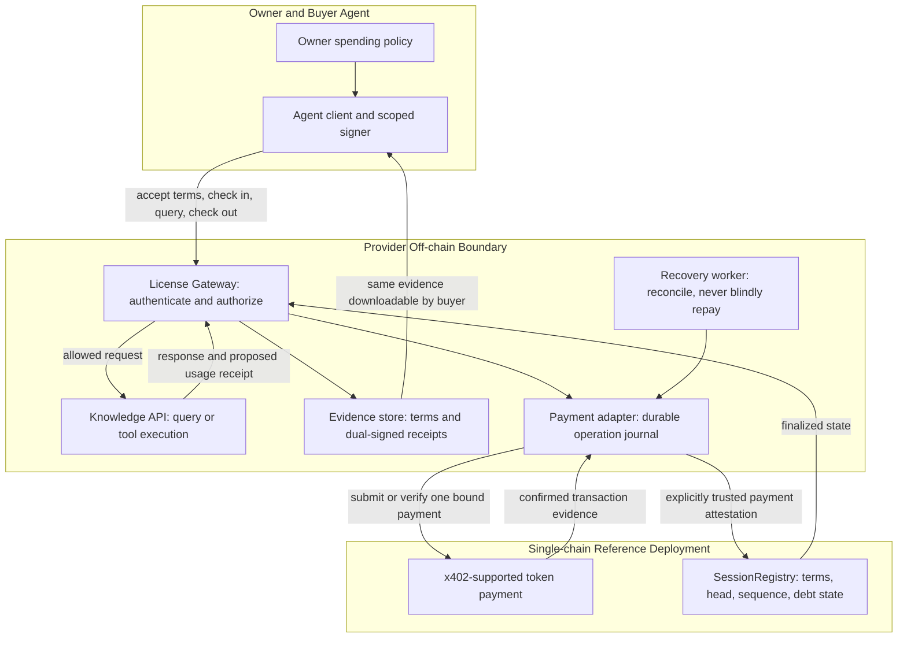
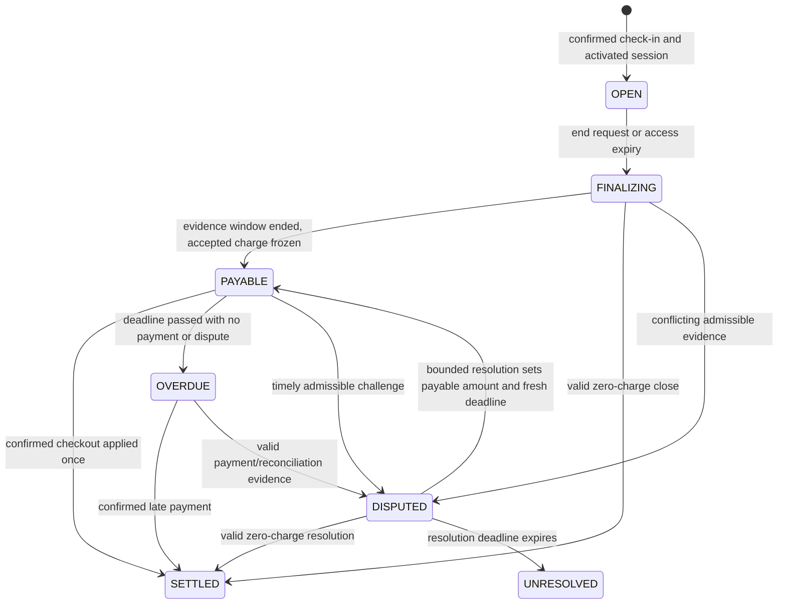

# ALSP: Agent License Session Protocol

## Hash-linked access licenses and accountable check-out settlement

**Whitepaper v0.1.0 · Design draft · 30 September 2026**  
**Author / project proposer:** Jinwoo Jang (장진우)  
**Status:** Research and engineering proposal, not a deployed or audited protocol.  
**한국어:** [한국어 백서](../ko/whitepaper.md)

> A license ending must stop further access; it must not erase an already accepted settlement obligation. Conversely, an expired license is not proof that its holder defaulted.

## Abstract

ALSP proposes a session layer for agents that purchase access to knowledge APIs and tools. A buyer accepts a versioned license and bounded financial terms at check-in, uses a gated service while the license remains effective, and settles an attributable obligation at check-out. Hash-linked records connect the initial agreement, accepted usage, final charge, and settlement evidence. A session registry records commitments and state, while a gateway enforces access to the off-chain service.

The motivating transaction is not the sale of a better general-purpose agent. It is the sale of permission to use a particular provider's resource under explicit conditions. The reference business profile preserves two x402 payment interactions: an access fee at check-in and a separately authorized charge at check-out. A prefunded profile is considered separately; it is economically a deposit and release, not unsecured postpayment.

ALSP does not claim to prevent copying of plaintext responses, prove knowledge quality, interpret arbitrary legal language, identify a person uniquely from a wallet, or guarantee recovery of unsecured debt. A provider-local restriction can discourage default only when continued access or an independently established relationship has value. Existing work on usage-control obligations, blockchain data access, and deferred x402 settlement substantially overlaps the design. The proposed contribution is a testable composition of license binding, session closure, and failure-aware accounting, not the invention of hashes, licenses, escrow, or two-stage billing.

## 1. Problem and proposed customer

A knowledge provider may already sell a dataset, private analysis service, or proprietary tool. Its customers may already have capable agents. Neither side necessarily needs another agent marketplace. They may instead need a reliable answer to four operational questions: what permission was purchased, which resource version it applies to, which usage was accepted as billable, and whether the resulting obligation has been settled.

A plain payment receipt does not answer all four. A license document alone does not connect its conditions to runtime access. A blockchain commitment cannot establish that a natural-language restriction was obeyed. ALSP separates these concerns and supplies an explicit lifecycle between them.

The initial customer hypothesis is one provider with an existing repeat customer using a metered knowledge API. A first pilot should use material the provider is authorized to license. Access distribution rights, privacy requirements, and the validity of contractual restrictions require separate review. Cryptographic commitments do not create intellectual-property rights.

The product hypothesis is that an installable session adapter can reduce disputes, manual reconciliation, and uncertainty about permitted API use. Demand, willingness to pay, and an advantage over existing billing products have not been demonstrated. Directory listing, synthetic payments, and internal test users are not evidence of market adoption.

## 2. Scope and terminology

A **resource** is an identified service or versioned knowledge source. A **license policy** states permissions, prohibitions, duties, and restrictions. A **session** binds one buyer, one provider, one resource version, and one immutable set of terms. **Access expiry** stops new service calls. **Settlement due** is the deadline for paying a determinable, accepted charge. A **checkout quote** describes that charge; it does not prove payment. A **payment reference** identifies a ledger operation; its hash alone is not a settlement proof.

ODRL provides an existing model for permissions, prohibitions, constraints, and duties [R1]. ALSP should define a narrow supported policy profile rather than invent an unrestricted rights language. The draft is not yet an ODRL conformance claim. Initially, the gateway can enforce resource identity, allowed endpoint/action, time, account scope, and usage limits. Statements such as “no model training” may be contractual restrictions; they are not automatically enforceable after plaintext leaves the controlled environment.

Normative words such as MUST describe the intended reference profile, not the existence of a conforming implementation. API names and data examples in this book are proposals. No production address, token sale, partnership, patent clearance, or investment return is asserted.

## 3. Architecture and trust boundaries

The design has six functional layers. They may share deployment infrastructure, but their authority must remain distinct.

| Layer | Responsibility | Must not be assumed |
| --- | --- | --- |
| Agent / owner authorization | Review and sign bounded terms, usage acknowledgments, and payments | The model can authorize its own spending |
| License Gateway | Authenticate the buyer, enforce supported policy, issue quotes, keep durable operation records | An API response alone proves ledger settlement |
| Knowledge Service | Execute an allowed query and supply response provenance | An output hash proves correctness or permitted downstream use |
| Evidence Store | Retain terms, receipts, signatures, and hash-linked history for both parties | A hash makes the underlying records available |
| x402 Payment Adapter | Verify the selected scheme and network; bind confirmed payments to one operation | Every facilitator supports arbitrary session contracts |
| SessionRegistry | Enforce typed state-transition rules, fixed caps, receipt uniqueness, and local default state | The contract reads the internet or wakes itself on a timer |



In the baseline compatibility adapter, the registry trusts a declared payment-attestation role to validate chain evidence. This is an explicit trust assumption, not cryptographic verification of a payment merely because a receipt hash was supplied. A stronger same-chain router could combine payment and registry transition in one transaction, but it requires its own verified integration; ordinary x402 transfers do not call arbitrary ALSP functions automatically.

## 4. Two economic profiles, not one ambiguous promise

### 4.1 P1: check-in fee plus unsecured check-out

The buyer pays access fee `F_in`, receives an activated license session, and later authorizes checkout charge `F_out`. New sessions can be denied for a finalized, overdue obligation. Neither a token allowance nor a signed future intention reserves the buyer's funds. The provider bears default risk.

For the initial metered profile:

```
F_out = acceptedUnits * unitPrice
0 <= F_out <= maxCheckoutLiability
TotalPaid = F_in + F_out
```

The gateway MUST refuse further billable usage before it would exceed the accepted cap; it must not silently accumulate excess and clamp the invoice afterward. The access fee MUST NOT be charged again at checkout. A zero checkout amount closes without a second token transfer; it is not a reason to invent a positive charge.

A fictional six-decimal-token example has an access fee of 1.00, unit price 0.50, and eleven accepted units. Checkout is 5.50 and total payment is 6.50. These are examples, not published prices or measured economics.

### 4.2 P2: prefunded extension

The buyer locks a checkout ceiling `D` and a later settlement pays the accepted charge and returns or credits the remainder. This requires rules for retrieval, timeout exits, disputes, blocked tokens, and custody. It reduces unsecured exposure but increases committed capital. It is not the same as two independent payments and is outside the first P1 conformance target.

A deposit does not prove service quality. Even under P2, disputed usage must not be paid merely because the provider submitted a number. No unlimited pull authorization, collateral seizure, or penalty not accepted at check-in is part of this draft. ERC-20 allowance and authorized token transfers are distinct from reserved funds [R2, R3].

## 5. Terms and license identity

Before any check-in payment, the buyer MUST receive the exact terms, policy version, and supported machine-enforced fields. Both parties approve the same terms. License metadata returned after payment is a receipt for a prior agreement, not an opportunity to add new obligations.

Terms bind protocol version, chain, registry, session ID, buyer, provider, resource and resource-version hashes, license-policy hash, access scope, pricing model, access fee, checkout rate and cap, quote-valid-until, access expiry, evidence-submission interval, checkout payment interval, termination/refund rules, and dispute rules. The payment adapter and any dispute authority must be identified before acceptance.

A document commitment and on-chain typed fields have different jobs. The contract enforces explicit numeric and identity fields; it does not interpret JSON. The buyer and gateway MUST reject a mismatch between the signed document and typed opening authorization. The typed authorization includes the document hash and all fields the contract uses. Unknown versions or unsupported policy actions fail closed.

Deleting a credential or expiring an access token MUST NOT delete the session's accepted obligations. A new version of the license creates a new agreement; the provider cannot overwrite the old terms hash. License renewal is not a silent extension of a payment mandate.

## 6. Check-in, use, termination, and check-out

### Check-in

Validate the request, service readiness, account eligibility, and operation idempotency before requesting payment. Issue a stable quote tied to the terms and intended `CHECKIN` operation. After the confirmed payment is durably bound and the registry opening is confirmed, issue a short-lived, audience-bound access credential. Access is not activated on a submitted transaction alone.

If payment succeeds but opening fails, keep a recoverable record and return `202` with an authenticated status endpoint. Retry applying the same confirmed payment, not collecting another payment. A bounded activation deadline and a disclosed refund path are required. The P1 compatibility adapter leaves this refund path dependent on provider/adapter operation; it does not claim guaranteed on-chain refunds.

### Metered use

Each proposed usage receipt references the current acknowledged head, next sequence, request ID, response hash, resource version, cumulative units, and validity window. The provider signs it. In the initial profile, the buyer signs an acknowledgment after receiving the response and before its next metered request. Only jointly acknowledged receipts are accepted as billable evidence.

This ordering intentionally leaves the provider exposed to an unacknowledged response. One outstanding request per recognized buyer/resource and bounded unit cost limit this exposure only within that enforced identity and concurrency scope. A new wallet can evade the scope. The design is not a solution to fair exchange or Sybil resistance.

Receipt checkpoints advance a single recognized head. Before selecting the next receipt, the gateway must reconcile any newer valid checkpoint it recognizes. A crash between response delivery and acknowledgment does not justify manufacturing a buyer signature or counting the response as accepted usage.

### End of access

Natural expiry, the buyer's early termination, and a permitted provider termination stop new service calls. They do not themselves settle money or imply default. Termination MUST NOT increase a liability cap or create charges for future unused service. Previously accepted receipts remain evidence.

A bounded evidence-submission window permits either party to submit its latest jointly signed cumulative receipt. Finalization freezes the accepted head and computes the charge using the original rate. Any conflicting signed branches enter review rather than being silently reconciled by the provider. A provider-issued invoice with no accepted basis cannot create an automatic debt ban.

### Check-out

Checkout references the session ID, original terms hash, frozen head, final sequence, accepted units, exact charge, and a fresh quote nonce. The payment operation additionally binds phase `CHECKOUT`, chain, token, payee, payer, and quote hash. After payment finality and registry application, append the settlement event and return a closed receipt. A second submission of the same completed operation returns its prior receipt without another transfer or another state advance.

If the buyer disappears, the provider can finalize only the last valid accepted usage after the agreed evidence window. The P1 registry can identify a bounded overdue obligation; it cannot forcibly obtain missing funds.

## 7. State model

Access and settlement are separate dimensions. A session's financial state cannot be inferred from whether an access credential still exists.

| Dimension | States or predicates |
| --- | --- |
| Access | `PENDING`, `ACTIVE`, `ENDED`, `CANCELLED_BEFORE_ACTIVATION` |
| Settlement | `OPEN`, `FINALIZING`, `PAYABLE`, `SETTLED`, `OVERDUE`, `DISPUTED`, `UNRESOLVED` |
| Adapter processing | independent operation state, including `PAYMENT_UNKNOWN` and `REGISTRY_PENDING` |

`ACTIVE` is effective only before access expiry and while the scoped gateway policy permits use. The derived predicate checks chain time and finalized state even if no timer transaction has materialized an expiry event. EVM state changes require execution; time passing alone does not call a function [R4].



`UNRESOLVED` is not a synonym for paid, refunded, or guilty. Automatic default attribution is suspended; the provider may separately decline future business under its stated service policy. This deliberately weakens automated collection rather than inventing a verdict. Dispute rules and authority are disclosed in the terms; production arbitration and automated adjudication are not delivered by this paper.

The provider-local restriction key is `(provider, buyer)`. A finalized nonzero unpaid obligation may prevent new check-ins for that provider. Other providers do not inherit the ban. Status, evidence export, reconciliation, dispute, and checkout endpoints remain available. Paying one overdue session does not clear a different overdue session, and applying the same payment twice must not decrement a default counter twice.

## 8. Hash-linked evidence and optional Merkle anchoring

The authoritative encoding profile is specified in [Data and API Appendix](../appendix.md). Human-readable JSON uses JCS [R5]; money and large counters are decimal strings. Duplicate keys, noncanonical integer strings, and unknown signed fields are rejected. Signatures are outside the payload they authenticate. EIP-712 domain separation is used for the proposed EVM authorization messages, with application-level nonces and replay rules [R6].

```
termsHash = keccak256(UTF8("ALSP:TERMS:0.1") || 0x00 || JCS(terms))
H0 = termsHash
Hi = keccak256(UTF8("ALSP:EVENT:0.1") || 0x00 || JCS(event_i))
```

Each `event_i` contains the domain, session ID, sequence, `prevHash`, event type, and payload hash. A transition MUST verify the prior head and next sequence or verify a complete bounded chain from a known checkpoint. Merely presenting a larger sequence with an arbitrary new hash is insufficient. For the serial reference implementation, checkpoints are applied in order.

Checkout creates a hash after the final accepted usage head; confirmed settlement creates the next hash. The original terms hash is retained permanently as a reference. The settlement event references a unique payment ID; it does not include its own eventual transaction hash in its preimage, avoiding a circular commitment. That transaction reference is attached to the external receipt.

Merkle batching is optional. Leaves can commit to `(domain, sessionId, seq, headHash, status)` checkpoints, and the anchored batch root can support inclusion verification [R7]. It does not prove that no input was omitted, that the log never forked before anchoring, or that an output used only licensed inputs. Root publication also does not preserve source evidence. Both parties must retain the documents and receipts necessary to reconstruct the commitments.

## 9. Payment integration and crash consistency

x402 v2 provides payment requirements, payloads, and facilitator interfaces; its core specification leaves application session handling outside its scope [R8]. Deferred charging is not unique to ALSP: `upto` and `batch-settlement` are relevant comparisons [R9, R10]. A described scheme is not necessarily supported by a chosen client, token, or facilitator.

The compatibility design uses standard x402 signaling for each required payment and an explicitly custom ALSP binding outside any claim of standardized license semantics. It does not rename a receipt hash into a payment proof. A payment adapter verifies the relevant finalized transfer, token, amount, parties, scheme-specific nonce, and operation binding before attesting it to the registry. A payment identifier includes the chain and the uniquely identified transfer within a transaction, not merely a transaction hash that may contain several transfers.

The journal is written before network submission. Database uniqueness applies to the operation idempotency key and consumed payment ID. Lease or fencing rules prevent two workers from settling the same operation concurrently. External payment and registry transactions are not atomic in this profile, so the journal is a recovery mechanism, not an “exactly once” network guarantee.

On timeout, return pending and query the existing operation. Never infer nonpayment from an HTTP timeout; never create a new authorization automatically. A valid payment followed by a `429` or registry failure is not a completed checkout. Wrong token, payee, payer, amount, phase, terms, or reused payment evidence is rejected. Read-only status queries are free and authenticated, without bearer tokens in URLs.

## 10. EVM reference and XRPL compatibility

The proposed first reference uses one EVM test network, one explicitly allowlisted token, and EOA buyer/provider signers. Same-chain typed state and signature checks are easier to express directly for this design. Production smart-account support needs a separately tested signature-validation profile; it must not be simulated by accepting any recovered address.

XRPL is a useful alternative for a server-governed implementation. Credentials can represent issuer/subject authorization and expiry, but deleting a credential must not erase a financial obligation [R11]. Native escrow and payment features must be used within their documented conditions [R12]. T54 documents an XRPL `exact` payment adapter; it does not imply automatic execution of an ALSP EVM contract [R13].

If XRPL payments and an EVM registry are combined, an additional cross-ledger attestation or verified bridge is required. That trust, finality, liquidity, and recovery complexity is excluded from v0.1. SmartEscrow appears as in development on the consulted XRPL amendments page; it is not a required deployed dependency [R14]. This paper selects a reference architecture, not a claim that EVM is universally better or XRPL cannot support license services.

## 11. Security objectives and limits

| Property to test | Required behavior |
| --- | --- |
| Terms integrity | Price, scope, cap, domain, and deadlines cannot be changed after acceptance |
| Authorization | Opening and billable acknowledgments require the intended parties' valid signatures |
| Session isolation | A receipt or payment cannot close a different session or phase |
| Accounting | Checkout excludes the already paid access fee and never exceeds accepted liability |
| Head consistency | A transition cannot overwrite an unrelated head or skip unchecked history |
| Fail-closed access | Expired or unknown access state cannot silently authorize new service calls |
| Default fairness | No automatic ban from an unsigned invoice, expired access alone, or unresolved payment |
| Recovery | Confirmed payment remains recoverable after process failure; no automatic duplicate debit |
| Data boundaries | Untrusted resource text cannot modify payment authority, terms, or signer selection |
| Availability | Evidence is retrievable by the buyer; a hash is not presented as stored data |

Threats include malicious buyers withholding acknowledgments, Sybil wallets, provider overbilling or selective evidence disclosure, stolen signing keys, replay, database races, chain reorganization, gateway censorship, and payment-adapter compromise. The reference inherits token issuer controls and chain execution/finality assumptions. A compromised trusted adapter can falsely attest payment unless a stronger on-chain verifier/router replaces it; this remains a material trust boundary.

No mechanism here proves that an off-chain document is truthful or that a buyer did not copy it. License and transaction metadata can disclose commercial relationships. Hashes of low-entropy inputs can be guessed, so hashing is not an anonymization or confidentiality guarantee. Raw knowledge, identity records, prompts, and private contract prose should not be published on-chain by default.

## 12. Economic rationale and falsifiable pilot

For a recognized repeat customer, default may be unattractive when its gain is smaller than enforceably recoverable collateral plus the value of future access it loses. That is an incentive hypothesis, not a security theorem. Disposable identities and replaceable data make access restrictions weak. A cap limits loss per accepted session, not aggregate losses across Sybil accounts.

The pilot must compare ALSP against a normal prepaid API key and a conventional metered invoice, not against an artificially manual process. Record integration effort, checkout completion, unpaid accepted usage, payment-to-close recovery time, false-default events, accepted billing disputes, buyer intervention time, and cost per session. Measure actual token fees, gateway cost, evidence storage, and capital lock-up separately. No throughput, gas saving, collection rate, or revenue advantage has yet been measured.

A useful initial test is one authorized provider and a small set of consenting existing customers. Start without real-value tokens. Inject failures after payment confirmation and before registry application, restart the gateway, submit duplicate receipts, and simulate a missing final acknowledgment. A pilot fails its product hypothesis if customers prefer an ordinary API subscription or if compliance overhead exceeds the benefit.

## 13. Related work and claim boundary

| Reference | Overlap | What remains to compare |
| --- | --- | --- |
| ODRL [R1] | Policies and duties attached to assets | Execution profile and failure-aware payment binding |
| PrivacyGuard [R15] | Policy-governed private-data use, blockchain records, TEE-assisted completion/payment | Different trust and delivery assumptions; ALSP does not provide its TEE guarantees |
| x402 `upto` [R9] | Capped actual-use settlement | Request payment versus explicitly versioned license/session obligations |
| x402 `batch-settlement` [R10] | Deferred commitments, repeated use, later settlement | License-term binding and default/recovery semantics need an implementation-level comparison |
| LICENSE402 [R16] | x402 purchase, signed rights/terms, agent permission checks | Creator description reviewed; exact session termination/default behavior and code not exhaustively audited |
| Hash logs / Merkle proofs [R7] | Commitment inclusion and consistency | They are reused primitives, not proof of usage truth or legal compliance |

PrivacyGuard explicitly combines blockchain policy and attested off-chain execution [R15]. The proximity of these systems prevents a claim that “license plus blockchain plus delayed payment” is new. This review is not an exhaustive literature or patent search and establishes no absence of exact prior art. A possible systems contribution is an explicit, testable failure model for license-bound session closure with limited identity assumptions. Its significance remains to be demonstrated against the above baselines.

## 14. Implementation plan and unresolved decisions

Stage 0 is this bilingual design and wire-format draft. Stage 1 should produce local transition tests, canonicalization vectors, signature/replay tests, and a fake payment adapter with crash injection. Stage 2 is a testnet P1 reference with one resource and a disclosed payment-attestation role. Stage 3 is a reviewed provider pilot; mainnet activation requires separate security, operational, and legal review.

Before calling any version production-ready, select and pin the actual x402 client/facilitator scheme, token and confirmations; finalize the metering acknowledgment protocol; specify dispute authority and bounded resolution; implement activation failure refunds; and verify restart recovery and external-call idempotency. P2 deposits, smart accounts, atomic routers, cross-chain settlement, downstream royalties, ZK, transferable licenses, and shared ban networks are not silently included.

ALSP is documented beside Handsel because the concept arose during its agent-commerce work. Existing Handsel job escrow, work proofs, and its XRPL endpoint are not an ALSP implementation. This documentation changes no payment route and enables no live collection.

## Conclusion

ALSP's intended boundary is narrow: an agent's permission to access a resource can expire without losing the record of what it accepted and what it still owes. Linking check-in, accepted usage, and check-out makes those facts inspectable. It does not turn access control into universal DRM or turn a commitment into truth. The next deliverable is evidence that the bounded protocol behaves correctly under failure and solves an existing provider/customer problem better than simpler billing.

**Appendix:** [Data, API, and validation examples](../appendix.md)  
**Sources:** [Bibliography and reading limits](../references.md)  
**Publication:** [GitBook publication notes](../PUBLISHING.md)

[R1]: https://www.w3.org/TR/odrl-model/
[R2]: https://eips.ethereum.org/EIPS/eip-20
[R3]: https://eips.ethereum.org/EIPS/eip-3009
[R4]: https://ethereum.org/en/developers/docs/smart-contracts/
[R5]: https://www.rfc-editor.org/rfc/rfc8785
[R6]: https://eips.ethereum.org/EIPS/eip-712
[R7]: https://www.rfc-editor.org/rfc/rfc9162
[R8]: https://github.com/x402-foundation/x402/blob/main/specs/x402-specification-v2.md
[R9]: https://github.com/x402-foundation/x402/blob/main/specs/schemes/upto/scheme_upto.md
[R10]: https://github.com/x402-foundation/x402/blob/main/specs/schemes/batch-settlement/scheme_batch_settlement.md
[R11]: https://xrpl.org/docs/concepts/decentralized-storage/credentials
[R12]: https://xrpl.org/docs/concepts/payment-types/escrow
[R13]: https://docs.t54.ai/docs/xrpl/x402-facilitator
[R14]: https://xrpl.org/resources/known-amendments
[R15]: https://arxiv.org/abs/1904.07275
[R16]: https://www.hackquest.io/projects/LICENSE402
