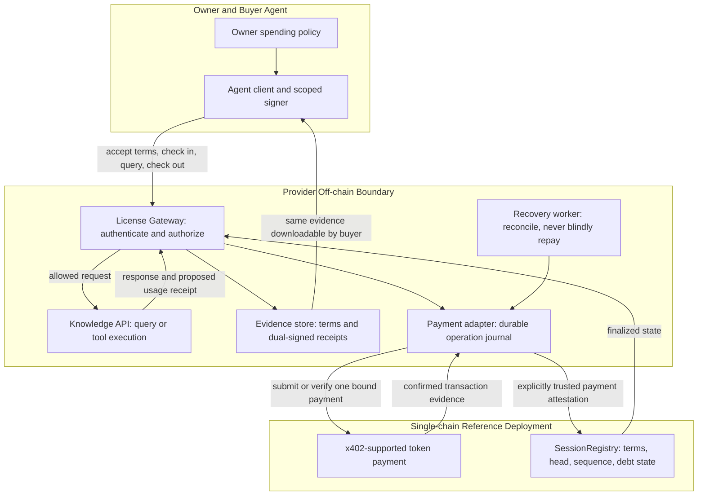
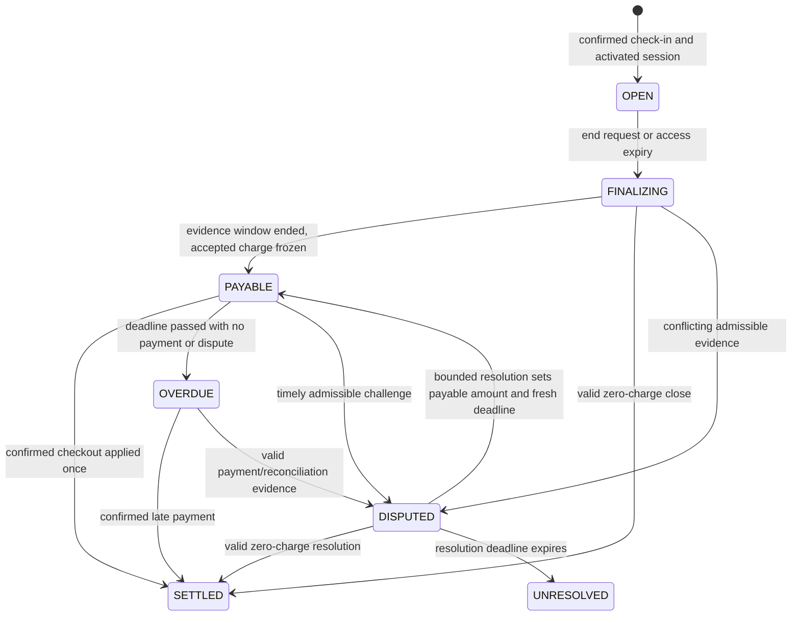

# ALSP: 에이전트 라이선스 세션 프로토콜

## 해시로 연결한 이용권과 책임 있는 체크아웃 정산

**백서 v0.1.0 · 설계 초안 · 2026년 9월 30일**  
**저자 / 프로젝트 제안자:** 장진우 (Jinwoo Jang)  
**상태:** 연구·개발 제안. 배포·감사 완료된 프로토콜이 아니다.  
**English:** [English whitepaper](../en/whitepaper.md)

> 라이선스의 종료는 추가 접근을 중단해야 하지만, 이미 승인한 정산 의무를 지워서는 안 된다. 반대로 이용권이 만료됐다는 사실만으로 그 이용자를 미납자로 판단해서도 안 된다.

## 초록

ALSP는 지식 API와 도구를 구매하는 에이전트를 위한 세션 계층을 제안한다. 구매자는 체크인에서 버전이 고정된 라이선스와 한도가 있는 금전 조건에 동의하고, 이용권이 유효한 동안 통제된 서비스를 사용한 뒤, 체크아웃에서 해당 세션에 귀속되는 의무를 정산한다. 해시로 연결한 기록은 최초 합의, 승인된 사용량, 최종 청구액, 결제 증거를 연결한다. 세션 레지스트리는 커밋먼트와 상태를 기록하고, 게이트웨이는 오프체인 서비스의 접근을 통제한다.

판매 대상은 더 좋은 범용 에이전트가 아니라 특정 공급자의 자원을 명시된 조건으로 이용할 권리다. 기준 사업 모델은 체크인의 접근료와 체크아웃의 별도 승인된 이용료라는 두 x402 결제 상호작용을 유지한다. 선예치 모델은 별도로 다룬다. 이는 예치 후 지급이지 무담보 후불이 아니다.

ALSP는 평문 응답의 복사를 차단하거나, 지식의 진실성을 보증하거나, 임의의 법률 문장을 해석하거나, 지갑 하나를 유일한 사람으로 식별하거나, 무담보 채권 회수를 보장하지 않는다. 공급자 내부의 이용 제한은 계속 이용할 가치나 별도로 형성된 거래 관계가 있을 때에만 유의미한 억제가 될 수 있다. 이용 후 의무 관리, 블록체인 기반 데이터 접근, x402 후정산에는 가까운 선행이 있다. 제안하는 기여는 라이선스 결박, 세션 종결, 실패를 구분하는 회계를 검증 가능한 형태로 결합하는 것이며, 해시·라이선스·에스크로·2단계 과금 자체의 발명이 아니다.

## 1. 문제와 초기 고객

지식 제공자는 이미 데이터셋, 비공개 분석 서비스, 독자 도구를 판매하고 있을 수 있다. 고객 역시 충분한 성능의 에이전트를 보유했을 수 있다. 양쪽 모두 새로운 에이전트 시장이 필요한 것은 아니다. 대신 무엇을 허락받았는지, 어느 자원 버전에 적용되는지, 어떤 사용량을 과금 대상으로 승인했는지, 그 의무가 정산됐는지를 일관되게 확인할 필요가 있다.

일반 결제 영수증만으로 이 네 가지를 모두 확인하기는 어렵다. 라이선스 문서만으로는 조건과 실행 중의 접근을 연결할 수 없다. 블록체인에 해시를 남겼다는 사실도 자연어 제한의 준수를 입증하지 못한다. ALSP는 이 문제들을 분리하고 그 사이의 수명주기를 명시한다.

초기 고객 가설은 기존에 반복 구매하는 고객을 가진 지식 API 제공자 한 곳이다. 첫 실험에서는 제공자가 이용 허락 권한을 보유한 자료를 사용해야 한다. 재판매 권한, 개인정보 처리 요구사항, 계약 제한의 효력은 별도의 검토가 필요하다. 암호학적 기록이 지식재산권을 새로 만들어주지는 않는다.

제품 가설은 설치 가능한 세션 어댑터가 분쟁, 수동 대사, 허용된 API 이용 범위의 불확실성을 줄인다는 것이다. 실제 수요·지불 의사·기존 과금 도구 대비 우위는 아직 입증되지 않았다. 디렉터리 등록, 합성 결제, 내부 테스트 사용자는 시장 채택의 증거가 아니다.

## 2. 범위와 용어

**자원(resource)**은 식별된 서비스 또는 버전이 지정된 지식 원천이다. **라이선스 정책**은 허용·금지·의무·제약을 기술한다. **세션**은 구매자 한 명, 공급자 한 명, 자원 버전 하나, 변경 불가능한 조건 집합 하나를 연결한다. **접근 만료**는 새로운 서비스 호출을 중단한다. **정산 기한**은 계산 가능하고 승인된 청구액을 지급할 마감이다. **체크아웃 견적**은 그 금액을 설명하는 문서이지 결제 증명이 아니다. **결제 참조**는 원장의 특정 작업을 식별하며, 그 참조의 해시만으로 결제가 증명되지는 않는다.

ODRL은 자원에 대한 허용·금지·제약·의무를 표현하는 기존 모델이다 [R1]. ALSP는 범용 권리 언어를 새로 만들기보다 지원 범위를 좁힌 정책 프로파일을 정의해야 한다. 이 초안은 ODRL 적합성 인증을 주장하지 않는다. 초기 게이트웨이가 집행할 범위는 자원 식별, 허용된 엔드포인트·행동, 시간, 계정 범위, 사용량 상한이다. ‘모델 학습 금지’ 같은 조항은 계약상 제한으로 남을 수 있으며, 평문이 통제된 환경 밖으로 나간 이후 자동 집행되는 것은 아니다.

이 문서의 MUST 등 규범 표현은 향후 기준 구현이 만족해야 할 요구사항이다. 현재 적합 구현이 존재한다는 뜻이 아니다. API 이름과 데이터 예시는 제안이며, 운영 주소·토큰 판매·파트너십·특허 비침해·투자수익을 주장하지 않는다.

## 3. 아키텍처와 신뢰 경계

설계는 여섯 기능 계층으로 나눈다. 같은 서버에 배포할 수 있어도 각 계층의 권한은 구분해야 한다.

| 계층 | 책임 | 가정해서는 안 되는 것 |
| --- | --- | --- |
| 에이전트 / 소유자 승인 | 한도가 있는 조건·사용 승인·결제에 서명 | 모델이 자신의 지출을 스스로 승인한다 |
| License Gateway | 구매자 인증, 지원 정책 집행, 견적 발행, 작업 기록 보존 | API 응답만으로 원장 정산이 증명된다 |
| Knowledge Service | 허용된 질의를 실행하고 응답의 출처를 제공 | 출력 해시가 정확성이나 후속 사용의 적법성을 증명한다 |
| Evidence Store | 양측이 확인할 조건·영수증·서명·해시 이력을 보존 | 해시가 있으면 원본 자료도 보관돼 있다 |
| x402 Payment Adapter | 지원 결제 방식·네트워크를 검증하고 확정 결제를 한 작업에 연결 | 모든 facilitator가 임의의 세션 계약을 지원한다 |
| SessionRegistry | 구조화된 전이 규칙, 고정 상한, 영수증 고유성, 공급자 내부 미납 상태 관리 | 계약이 인터넷을 읽거나 타이머로 스스로 실행된다 |



기준 호환 어댑터에서는 레지스트리가 공개된 결제 증언 역할을 신뢰해 원장 증거를 검증한다. 이는 명시적인 신뢰 가정이다. 영수증 해시를 제출했다는 이유만으로 계약이 결제를 암호학적으로 검증하는 것이 아니다. 같은 체인의 별도 라우터에서 결제와 상태 변경을 한 트랜잭션으로 묶는 강화안은 가능하지만, 독립적인 연동 검증이 필요하다. 일반 x402 송금은 임의의 ALSP 함수를 자동 실행하지 않는다.

## 4. 서로 다른 두 경제 모델

### 4.1 P1: 체크인 접근료와 무담보 체크아웃

구매자는 접근료 `F_in`을 지급하고 활성화된 이용권을 받은 후, 체크아웃 이용료 `F_out`을 별도로 승인한다. 확정된 의무가 연체되면 해당 공급자의 신규 세션을 제한할 수 있다. 토큰 allowance나 미래 지급 의사에 대한 서명은 구매자의 자금을 따로 확보하는 장치가 아니다. 공급자는 미회수 위험을 부담한다.

초기 사용량 모델의 계산은 다음과 같다.

```
F_out = acceptedUnits * unitPrice
0 <= F_out <= maxCheckoutLiability
TotalPaid = F_in + F_out
```

게이트웨이는 승인된 상한을 넘기게 될 추가 과금 사용을 사전에 거부해야 한다. 초과 사용을 계속 쌓은 뒤 마지막 청구액만 잘라서는 안 된다. 체크인 접근료는 체크아웃에서 다시 청구하지 않는다. 체크아웃 금액이 0이면 두 번째 토큰 송금 없이 종료하며, 결제 두 번을 맞추려고 양수 금액을 만들어서는 안 된다.

가상의 소수점 6자리 토큰에서 접근료가 1.00, 단가가 0.50, 승인된 사용량이 11회라면 체크아웃은 5.50, 총지급은 6.50이다. 이는 설명용 예시이며 공개 판매 가격이나 측정된 사업 성과가 아니다.

### 4.2 P2: 선예치 확장

구매자가 체크아웃 상한 `D`를 미리 예치하고, 나중에 승인된 이용료를 지급한 뒤 나머지를 반환하거나 인출 가능한 잔액으로 남기는 방식이다. 인출·기한 경과 종료·분쟁·차단된 토큰·수탁에 대한 규칙이 필요하다. 무담보 위험은 줄지만 자금이 묶인다. 독립된 결제 두 번과는 다르며 첫 P1 적합성 목표 밖의 확장이다.

예치금은 서비스 품질의 증명이 아니다. P2에서도 공급자가 숫자를 제출했다는 이유만으로 분쟁 중 사용량을 지급해서는 안 된다. 무제한 출금 권한, 합의하지 않은 담보 몰수·벌금은 포함하지 않는다. ERC-20 allowance 및 서명된 송금 권한은 자금 예치와 구별된다 [R2, R3].

## 5. 체크인 조건과 이용권의 식별

첫 결제 전에 정확한 조건 문서, 정책 버전, 기계가 집행할 필드를 구매자에게 제공해야 한다. 양측이 같은 조건을 승인한다. 결제 후 반환하는 라이선스 메타데이터는 이전 합의의 영수증이지 새 의무를 추가하는 기회가 아니다.

조건에는 프로토콜 버전, 체인, 레지스트리, 세션 ID, 구매자, 공급자, 자원·버전 해시, 라이선스 해시, 접근 범위, 가격 모델, 접근료, 체크아웃 단가·상한, 견적 유효기한, 접근 만료, 증거 제출 기간, 체크아웃 지급 기간, 종료·환불 규칙, 분쟁 규칙이 들어간다. 결제 어댑터와 분쟁 처리 권한도 승인 전에 식별돼야 한다.

문서 커밋먼트와 온체인 구조화 필드의 역할은 다르다. 계약은 명시된 숫자·식별 필드를 검사할 뿐 JSON 문서를 해석하지 않는다. 서명된 문서와 구조화된 세션 개설 승인 내용이 다르면 구매자와 게이트웨이는 개설을 거부해야 한다. 구조화 서명에는 문서 해시와 계약이 사용하는 모든 필드를 포함한다. 알 수 없는 버전이나 지원하지 않는 정책 행동은 거부한다.

자격증명을 삭제하거나 접근 토큰을 만료시켜도 승인된 정산 의무는 삭제하지 않는다. 라이선스 변경은 새로운 합의를 요구하며 기존 termsHash를 덮어쓸 수 없다. 갱신은 결제 위임을 몰래 연장하는 수단이 아니다.

## 6. 체크인·이용·종료·체크아웃

### 체크인

결제를 요구하기 전에 입력, 서비스 준비 상태, 계정 자격, 작업 멱등성을 검사한다. 조건과 `CHECKIN` 작업에 연결된 고정 견적을 발행한다. 결제 확정 사실을 영구 기록하고 레지스트리 개설까지 확인한 다음, 수명이 짧고 대상 서비스가 고정된 접근 자격을 발급한다. 트랜잭션을 제출했다는 사실만으로 서비스를 열지 않는다.

결제 성공 후 개설이 실패하면 복구 가능한 기록과 인증된 상태 조회 주소를 `202`로 반환한다. 같은 확정 결제를 다시 적용할 뿐 돈을 새로 받지 않는다. 제한된 활성화 기한과 사전에 고지한 환불 경로가 필요하다. P1 호환 어댑터의 이 환불은 공급자·어댑터 운영에 의존한다. 강제되는 온체인 환불이라고 주장하지 않는다.

### 사용량 기반 이용

사용 영수증 제안은 현재 승인된 head, 다음 순번, 요청 ID, 응답 해시, 자원 버전, 누적 사용량, 유효기간을 참조하며 공급자가 서명한다. 초기 모델에서는 구매자가 응답을 받은 뒤, 다음 과금 요청 전에 수령·과금 승인에 서명한다. 양측이 승인한 영수증만 과금 증거로 인정한다.

이 순서에서는 마지막 응답에 구매자가 서명하지 않을 위험을 공급자가 부담한다. 식별된 구매자·자원마다 미승인 요청을 하나로 제한하고 건별 원가를 제한하면 해당 식별·동시성 범위 안에서만 위험을 제한할 수 있다. 새 지갑은 이 범위를 우회할 수 있다. 이 설계는 공정 교환이나 시빌 저항성의 해결책이 아니다.

체크포인트는 하나의 인정된 head를 전진시킨다. 다음 영수증을 선택하기 전에 더 새로운 유효 체크포인트가 확인됐다면 게이트웨이는 이를 대조해야 한다. 응답 전달 후 구매자 서명 전에 장애가 발생했다고 해서 구매자 서명을 만들거나 그 사용을 승인된 것으로 계산해서는 안 된다.

### 접근 종료

자연 만료, 구매자의 조기 종료, 약정된 공급자 종료는 새로운 서비스 호출을 중단한다. 그 자체로 돈을 정산하거나 미납을 뜻하지 않는다. 종료가 상한을 늘리거나 미래의 미사용분을 청구하는 계기가 되어서는 안 된다. 이전에 승인한 영수증은 유효한 증거로 남는다.

제한된 증거 제출 기간 동안 어느 쪽이든 최신 양측 서명 누적 영수증을 제출할 수 있다. 최종화는 승인된 head를 고정하고 최초 단가로 금액을 계산한다. 서로 충돌하는 서명 이력은 공급자가 임의로 정리하지 않고 검토 상태로 보낸다. 승인 근거가 없는 공급자 청구서만으로 자동 미납 차단을 만들 수 없다.

### 체크아웃

체크아웃은 세션 ID, 최초 termsHash, 고정된 head, 최종 순번, 승인 사용량, 정확한 금액, 새로운 견적 nonce를 참조한다. 결제 작업에는 `CHECKOUT` 단계, 체인, 토큰, 수신자, 지급자, 견적 해시도 결박한다. 결제 확정과 레지스트리 적용 후 정산 이벤트를 추가하고 종료 영수증을 반환한다. 완료된 같은 작업의 재전송은 기존 영수증을 반환하며 추가 송금·추가 상태 전이를 만들지 않는다.

구매자가 사라져도 공급자는 약정 증거 기간 뒤 마지막 유효 승인 사용량까지만 확정할 수 있다. P1 레지스트리는 한도가 있는 연체 의무를 식별할 수 있지만 없는 자금을 강제로 회수할 수는 없다.

## 7. 상태 모델

접근과 정산은 별개 차원이다. 접근 자격증명이 존재하는지로 금융 상태를 추론해서는 안 된다.

| 차원 | 상태 또는 판정 |
| --- | --- |
| 접근 | `PENDING`, `ACTIVE`, `ENDED`, `CANCELLED_BEFORE_ACTIVATION` |
| 정산 | `OPEN`, `FINALIZING`, `PAYABLE`, `SETTLED`, `OVERDUE`, `DISPUTED`, `UNRESOLVED` |
| 어댑터 작업 처리 | `PAYMENT_UNKNOWN`, `REGISTRY_PENDING` 등을 포함하는 독립 작업 상태 |

접근은 만료 전이고 해당 게이트웨이 정책이 허용할 때만 실질적으로 `ACTIVE`다. 타이머 트랜잭션이 만료 이벤트를 기록하지 않았어도 접근 판정은 체인 시각과 확정 상태를 읽는다. EVM 상태 변경은 실행을 필요로 하며 시간이 흐르는 것만으로 함수가 호출되지는 않는다 [R4].



`UNRESOLVED`는 지급 완료·환불 완료·유죄를 뜻하지 않는다. 자동 미납 귀속을 중단하고, 공급자는 별도로 고지한 영업 정책에 따라 향후 거래를 거절할 수 있다. 판정을 꾸미는 대신 자동 회수를 약하게 두는 선택이다. 분쟁 규칙과 권한은 조건에 고지하며, 이 백서가 운영 가능한 중재기관이나 자동 판결을 제공하는 것은 아니다.

공급자 내부 차단의 키는 `(provider, buyer)`다. 확정된 양수 금액이 미납이면 그 공급자의 신규 체크인을 제한할 수 있다. 다른 공급자는 이를 자동 상속하지 않는다. 상태 조회·증거 반출·대사·이의 제기·체크아웃은 계속 허용한다. 한 세션을 갚았다고 다른 연체 세션이 해소되지 않으며, 같은 지급을 재적용했다고 미납 건수를 두 번 감소시켜서는 안 된다.

## 8. 해시 이력과 선택적 머클 앵커링

정확한 인코딩 규칙은 [데이터·API 부록](../appendix.md)에 둔다. 사람이 읽는 JSON은 JCS를 사용하고 [R5], 금액과 큰 카운터는 10진 문자열로 표현한다. 중복 키, 비정규 정수 문자열, 알 수 없는 서명 필드는 거부한다. 서명은 자신이 인증하는 payload 밖에 둔다. EVM 승인 메시지에는 EIP-712 도메인 분리와 애플리케이션별 nonce·재사용 방지 규칙을 적용한다 [R6].

```
termsHash = keccak256(UTF8("ALSP:TERMS:0.1") || 0x00 || JCS(terms))
H0 = termsHash
Hi = keccak256(UTF8("ALSP:EVENT:0.1") || 0x00 || JCS(event_i))
```

각 `event_i`에는 도메인, 세션 ID, 순번, `prevHash`, 이벤트 종류, payload 해시가 들어간다. 전이는 이전 head와 다음 순번을 확인하거나, 인정된 체크포인트에서 이어지는 길이가 제한된 전체 연결을 검증해야 한다. 큰 순번과 임의의 새 해시만 제출해서는 안 된다. 직렬 기준 구현에서는 체크포인트를 순서대로 적용한다.

체크아웃은 마지막 승인 사용 head 다음 해시를 만들고, 확정 정산은 그 다음 해시를 만든다. 최초 termsHash는 계속 보존한다. 정산 이벤트의 입력에는 고유 paymentId를 넣되 자신의 아직 생성되지 않은 트랜잭션 해시는 넣지 않는다. 순환 커밋먼트를 피하기 위해 그 거래 참조는 외부 영수증에 첨부한다.

머클 배치는 선택 기능이다. `(domain, sessionId, seq, headHash, status)` 체크포인트를 leaf로 묶고 루트를 앵커링하면 포함 검증에 사용할 수 있다 [R7]. 입력이 하나도 빠지지 않았다는 것, 앵커 전 이력이 갈라지지 않았다는 것, 생산물이 라이선스가 있는 자료만 사용했다는 것은 증명하지 않는다. 루트를 게시해도 원본 증거가 보존되지는 않는다. 양측은 커밋먼트를 재구성할 문서와 영수증을 확보해야 한다.

## 9. 결제 연동과 장애 일관성

x402 v2는 결제 요구·payload·facilitator 인터페이스를 제공하고, 핵심 명세는 애플리케이션 세션 관리를 범위 밖에 둔다 [R8]. 후정산은 ALSP만의 발명이 아니다. `upto`, `batch-settlement`와 비교해야 한다 [R9, R10]. 명세가 존재한다고 선택한 클라이언트·토큰·facilitator가 지원한다는 뜻은 아니다.

호환 설계는 각각의 필요한 결제에 표준 x402 신호를 사용하되, ALSP 결박은 별도의 사용자 정의 규칙임을 명시한다. 라이선스 의미가 이미 표준화됐다고 주장하지 않는다. 결제 어댑터는 확정된 전송, 토큰, 금액, 양측, 방식별 nonce, 작업 결박을 확인한 뒤 레지스트리에 증언한다. paymentId는 체인과 트랜잭션 내부의 고유 전송을 식별해야 한다. 여러 전송이 들어 있는 거래의 해시만으로는 충분하지 않다.

네트워크 제출 전에 저널을 영구 기록한다. 데이터베이스는 작업 멱등성 키와 소비한 paymentId에 고유 제약을 둔다. lease 또는 fencing으로 두 worker의 동시 정산을 차단한다. 이 모델의 외부 결제와 레지스트리 트랜잭션은 원자적이지 않다. 따라서 저널은 복구 장치이지 네트워크 전체의 ‘정확히 한 번’ 보장이 아니다.

타임아웃이면 기존 작업을 조회하고 대기 상태를 반환한다. HTTP 타임아웃을 미결제로 해석하거나 새로운 지급 승인을 자동 생성해서는 안 된다. 결제 후 `429` 또는 레지스트리 오류가 발생한 것은 체크아웃 완료가 아니다. 토큰·수신자·지급자·금액·단계·조건이 다르거나 결제 증거가 재사용되면 거부한다. 상태 조회는 무료이며 인증을 요구하되 URL에 bearer token을 넣지 않는다.

## 10. EVM 기준 구현과 XRPL 호환성

첫 기준 구현은 EVM 테스트 네트워크 하나, 명시적으로 허용된 토큰 하나, EOA 구매자·공급자 서명자를 대상으로 한다. 이 설계에서는 같은 체인 안의 구조화된 상태·서명 검사를 직접 표현하기 쉽다. 스마트계정 지원은 별도로 검증한 서명 프로파일을 필요로 하며 임의의 복구 주소를 받아주는 식으로 흉내 내서는 안 된다.

XRPL은 서버가 상태를 관리하는 구현에서 유용한 대안이다. Credentials는 발급자·대상 계정의 권한과 만료를 표현할 수 있지만, 삭제가 채무를 지워서는 안 된다 [R11]. 기본 에스크로·결제는 공식 조건 안에서 사용해야 한다 [R12]. T54가 설명하는 XRPL `exact` 어댑터는 ALSP EVM 계약의 자동 실행을 뜻하지 않는다 [R13].

XRPL 결제와 EVM 레지스트리를 함께 쓰려면 추가적인 원장 간 증언 또는 검증된 브리지가 필요하다. 그 신뢰·확정성·유동성·복구 복잡성은 v0.1에서 제외한다. 조회한 XRPL amendments 페이지의 SmartEscrow는 개발 중으로 표시돼 있으며 필수 배포 의존성으로 삼지 않는다 [R14]. 이는 기준 아키텍처 선택이지 EVM의 보편적 우월성이나 XRPL의 이용권 서비스 불가능성을 주장하는 것이 아니다.

## 11. 보안 목표와 한계

| 검증할 성질 | 요구 동작 |
| --- | --- |
| 조건 무결성 | 승인 후 가격·범위·상한·도메인·기한을 바꿀 수 없다 |
| 권한 | 세션 개설과 과금 승인은 의도한 당사자의 유효 서명을 요구한다 |
| 세션 격리 | 다른 세션·다른 단계의 영수증이나 결제를 재사용할 수 없다 |
| 회계 | 체크아웃은 이미 낸 접근료를 제외하고 승인된 책임 상한을 넘지 않는다 |
| head 일관성 | 관련 없는 head로 덮어쓰거나 검증하지 않은 이력을 건너뛸 수 없다 |
| 접근 실패 차단 | 만료됐거나 상태를 확인할 수 없을 때 새 서비스를 몰래 허용하지 않는다 |
| 미납 판정의 공정성 | 미서명 청구·접근 만료·미확정 결제만으로 자동 차단하지 않는다 |
| 복구 | 확정 결제는 장애 후에도 복구 가능하고 자동 이중 출금되지 않는다 |
| 데이터 경계 | 자료 속 비신뢰 텍스트가 결제 권한·조건·서명자를 바꾸지 못한다 |
| 가용성 | 구매자가 증거를 가져갈 수 있고 해시를 원본 보관처럼 설명하지 않는다 |

위협에는 승인 서명을 하지 않는 구매자, 시빌 지갑, 공급자의 과다 청구·선택적 증거 공개, 서명 키 탈취, 재전송, DB 경합, 체인 재구성, 게이트웨이 검열, 결제 어댑터 침해가 있다. 기준 구현은 토큰 발행자의 통제와 체인의 실행·확정성 가정을 상속한다. 신뢰된 어댑터가 침해되면 결제를 거짓 증언할 수 있다. 더 강한 온체인 검증기·라우터로 대체하지 않는 한 중요한 신뢰 경계로 남는다.

어떤 장치도 오프체인 문서가 진실이라는 것, 구매자가 복사하지 않았다는 것을 증명하지 않는다. 라이선스·결제 메타데이터는 거래 관계를 드러낼 수 있다. 엔트로피가 낮은 입력의 해시는 추측할 수 있으므로 해싱은 익명화·비밀성 보장이 아니다. 원본 지식·신원 기록·프롬프트·비공개 약관은 기본적으로 온체인에 게시하지 않아야 한다.

## 12. 경제적 가설과 반증 가능한 실험

인식 가능한 반복 고객에게는 미납 이익보다 실제 회수 가능한 담보와 잃는 미래 접근 가치가 크면 미납 유인이 줄어들 수 있다. 이는 유인 가설이지 보안 정리가 아니다. 버릴 수 있는 신원과 대체 가능한 데이터에서는 접근 제한이 약하다. 상한은 승인한 한 세션의 손실을 제한할 뿐 시빌 계정 전체의 손실을 제한하지 않는다.

실험은 인위적으로 수작업을 늘린 과정이 아니라 일반 선불 API 키, 기존 사용량 청구와 비교해야 한다. 연동 노력, 체크아웃 완료율, 승인됐지만 미납된 사용량, 결제 후 종료 복구 시간, 오판 미납, 수용된 과금 이의, 구매자 개입 시간, 세션당 비용을 기록한다. 실제 토큰 수수료, 게이트웨이 비용, 증거 저장 비용, 자금 잠김은 분리 측정한다. 처리량·가스 절약·회수율·매출 우위는 아직 측정하지 않았다.

권한 있는 공급자 하나와 동의한 기존 고객 소수로 시작하고, 실가치 토큰은 사용하지 않는다. 결제 확정 후 레지스트리 적용 전에 실패를 주입하고, 게이트웨이를 재시작하고, 영수증을 중복 제출하고, 마지막 승인 서명이 사라지는 상황을 재현한다. 고객이 일반 구독 API를 선호하거나 관리 부담이 편익보다 크면 제품 가설은 기각한다.

## 13. 선행연구와 주장 범위

| 선행 | 겹치는 부분 | 남은 비교 과제 |
| --- | --- | --- |
| ODRL [R1] | 자원에 연결된 정책과 의무 | 실행 프로파일과 장애를 구분하는 결제 결박 |
| PrivacyGuard [R15] | 정책 기반 비공개 데이터 이용, 원장 기록, TEE 기반 완료·지급 | 신뢰·전달 가정이 다르며 ALSP가 TEE 보장을 제공하는 것은 아님 |
| x402 `upto` [R9] | 상한 안의 실제 사용 정산 | 요청 결제와 버전 있는 라이선스·세션 의무의 관계 |
| x402 `batch-settlement` [R10] | 지급 커밋먼트, 반복 사용, 나중 정산 | 라이선스 결박과 미납·복구 의미를 구현 단위로 비교할 필요 |
| LICENSE402 [R16] | x402 구매, 서명된 권리·조건, 에이전트 권한 검사 | 제작자 설명을 검토했으며 정확한 종료·미납 규칙과 코드는 전수 감사하지 않음 |
| 해시 로그·머클 증명 [R7] | 커밋먼트 포함·일관성 | 재사용하는 부품이며 사용량의 진실성·법적 준수 증명이 아님 |

PrivacyGuard는 블록체인 정책과 증명된 오프체인 실행을 명시적으로 결합한다 [R15]. 가까운 선행이 있으므로 ‘라이선스+블록체인+후정산’이 처음이라는 주장은 부적절하다. 이 검토는 전체 문헌·특허 조사가 아니며 정확한 선행의 부재를 입증하지 않는다. 연구 기여 후보는 제한된 신원 가정 아래 라이선스 세션 종결의 실패 모델을 명시하고 검증하는 것이다. 위 기준선과 비교해 그 의미를 입증해야 한다.

## 14. 구현 계획과 미결정 사항

0단계는 이 한·영 설계와 데이터 초안이다. 1단계에서는 로컬 전이 테스트, 정규화 벡터, 서명·재사용 방지, 가짜 결제 어댑터의 장애 주입을 구현한다. 2단계는 자원 하나와 공개된 결제 증언 역할을 가진 테스트넷 P1 구현이다. 3단계는 검토된 공급자 파일럿이며 메인넷 개통에는 별도 보안·운영·법률 검토가 필요하다.

운영 준비를 주장하기 전에 실제 x402 클라이언트·facilitator의 방식, 토큰, 확정 기준을 선택·고정하고, 사용 승인 프로토콜을 확정하고, 분쟁 권한과 제한된 해결 절차를 명세하고, 활성화 실패 환불과 재시작 복구·외부 호출 멱등성을 구현해야 한다. P2 예치, 스마트계정, 원자적 라우터, 다중체인 정산, 후속 판매 로열티, ZK, 양도 가능한 라이선스, 공유 밴 네트워크는 암묵적으로 포함하지 않는다.

ALSP를 Handsel 옆에 문서화하는 것은 그 개발 과정에서 제안이 나왔기 때문이다. 기존 Handsel의 작업 에스크로·작업 증명·XRPL 엔드포인트는 ALSP 구현이 아니다. 이 문서 변경은 결제 경로를 수정하거나 실제 요금 징수를 활성화하지 않는다.

## 결론

ALSP가 지향하는 보장 범위는 좁다. 자원 접근권이 만료돼도 에이전트가 무엇을 승인했고 무엇을 아직 정산하지 않았는지의 기록은 유지한다. 체크인, 승인 사용량, 체크아웃의 연결은 그 사실을 검토 가능하게 한다. 접근 통제를 보편적인 DRM으로 바꾸거나 커밋먼트를 진실로 바꾸지는 않는다. 다음 산출물은 장애 아래에서도 제한된 규칙이 올바르게 동작하고, 기존 공급자·고객 문제를 더 단순한 과금보다 잘 해결한다는 증거여야 한다.

**부록:** [데이터·API·검증 예시](../appendix.md)  
**출처:** [참고문헌과 자료 검토 범위](../references.md)  
**게시:** [GitBook 게시 안내](../PUBLISHING.md)

[R1]: https://www.w3.org/TR/odrl-model/
[R2]: https://eips.ethereum.org/EIPS/eip-20
[R3]: https://eips.ethereum.org/EIPS/eip-3009
[R4]: https://ethereum.org/en/developers/docs/smart-contracts/
[R5]: https://www.rfc-editor.org/rfc/rfc8785
[R6]: https://eips.ethereum.org/EIPS/eip-712
[R7]: https://www.rfc-editor.org/rfc/rfc9162
[R8]: https://github.com/x402-foundation/x402/blob/main/specs/x402-specification-v2.md
[R9]: https://github.com/x402-foundation/x402/blob/main/specs/schemes/upto/scheme_upto.md
[R10]: https://github.com/x402-foundation/x402/blob/main/specs/schemes/batch-settlement/scheme_batch_settlement.md
[R11]: https://xrpl.org/docs/concepts/decentralized-storage/credentials
[R12]: https://xrpl.org/docs/concepts/payment-types/escrow
[R13]: https://docs.t54.ai/docs/xrpl/x402-facilitator
[R14]: https://xrpl.org/resources/known-amendments
[R15]: https://arxiv.org/abs/1904.07275
[R16]: https://www.hackquest.io/projects/LICENSE402
